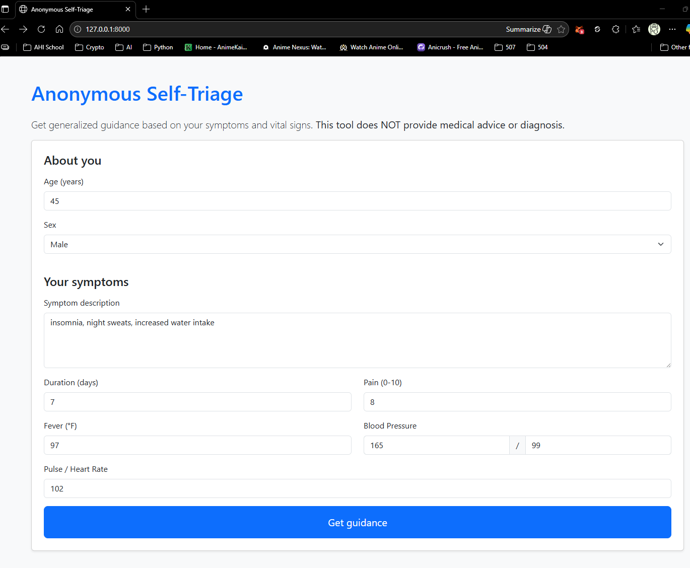
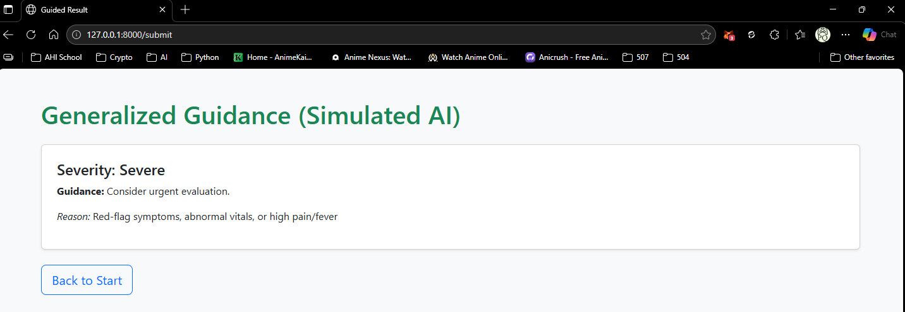

### Overview

Anonymous self-triage Flask app that collects symptoms and vital signs (age, sex, pain, fever, blood pressure, pulse), stores submissions in Azure Blob Storage, and displays generalized severity guidance using a placeholder heuristic. Replace the heuristic with Azure OpenAI or an Azure ML endpoint to align with the architecture plan.

### Prerequisites

- **Python 3.10+**
- **Azure Storage account** with a container (e.g., `intake`)
- **Credentials:**  
  - **Managed Identity** in Azure (recommended)  
  - For local dev, **Azure CLI login** or a **Connection String** in `.env`

### Setup

1. **Create venv and install:**
   - Windows: `python -m venv .venv && .venv\\Scripts\\activate`  
   - `pip install -r requirements.txt`
2. **Configure environment:**
   - Create `.env` with:
     - `AZURE_STORAGE_ACCOUNT=your_storage_account_name`
     - `AZURE_STORAGE_CONTAINER=intake`
     - Optional: `AZURE_STORAGE_CONNECTION_STRING=...` (local dev only)
3. **Run locally:**
   - `flask --app app run --debug`
4. **Deploy (optional):**
   - Deploy to **Azure App Service**; enable **Managed Identity**; grant Storage Blob Data Contributor on the container.

### Routes

- **GET /**: Anonymous intake form and list of recent submissions.  
- **POST /submit**: Saves intake JSON to `raw/`.  
- **GET /guidance**: Displays generalized severity guidance (placeholder AI) with a disclaimer.

### Notes

- **Disclaimers:** Prominently displayed on intake and guidance pages; the tool provides general information only.  
- **Swap-in real AI:** Replace `simulate_ai_scoring` with calls to **Azure OpenAI** or **Azure ML**; log prompts, model versions, and responses for governance.  
- **Next step:** Add an **Azure Function** to validate and write records to **Azure SQL** (`staging_intake`, `ai_scores`, `guidance_logs`).

---

## prototype/requirements.txt

```
flask==3.0.2
python-dotenv==1.0.1
azure-storage-blob==12.19.1
```

---
## Sample Input & Output

- **Sample Input Form:**  


- **Sample Output Result:**  


---