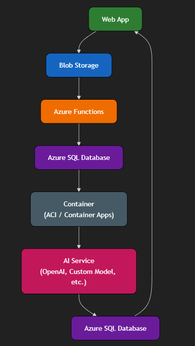

# System Overview

We’re building a straightforward pipeline to handle anonymous health intake and provide general guidance. The idea is to keep the flow simple, secure, and cost‑effective while making sure the data is processed cleanly and results are easy to understand. Here’s how the pieces fit together:

1. **Web App (Flask on Azure)**  
   - Collects anonymous info (age, sex, symptoms, vitals).  
   - Provides a simple interface for users to submit data and later view results.  
   - Acts as the main entry and exit point for the system.

2. **Blob Storage**  
   - First stop for raw submissions.  
   - Holds both raw and cleaned files so we can separate unprocessed data from validated records.  
   - Serves as a reliable, low‑cost archive.

3. **Azure Functions**  
   - Cleans and checks the data (e.g., valid ranges for vitals).  
   - Normalizes formats so everything is consistent.  
   - Loads the cleaned data into SQL for structured use.

4. **SQL Database**  
   - Central store for intake records, AI scores, logs, and performance metrics.  
   - Provides a structured way to query and analyze results over time.

5. **Container Apps**  
   - Runs scheduled jobs that batch new cases.  
   - Handles orchestration of AI calls so workloads are managed efficiently.

6. **AI Services (OpenAI/ML)**  
   - Assigns severity (mild/moderate/severe).  
   - Generates rationale and general guidance.  
   - Adds transparency by logging inference details.

Overall flow: **Web App → Blob → Functions → SQL → Container → AI → SQL → Web App**

---

# Workflow

- **Step 1: Intake**  
  User fills out the form → data saved in Blob.

- **Step 2: Validation**  
  Function checks ranges and formats → moves cleaned data to SQL staging.

- **Step 3: AI Scoring**  
  Container batches cases → AI assigns severity + rationale → results stored in SQL.

- **Step 4: Display**  
  Web App shows severity and guidance with disclaimers and red‑flag warnings.

- **Step 5: Metrics**  
  Scheduled jobs compare AI results against rule‑based checks → update performance metrics for ongoing improvement.

---

# Security & Privacy

- Use Managed Identity and Key Vault (no secrets in code).  
- Apply least privilege roles, HTTPS only, and private endpoints.  
- Collect only non‑identifiable data (age, sex, symptoms, vitals).  
- Encrypt data at rest and in transit, de‑identify analytics, and audit access regularly.

---

# Cost Notes

- Main costs: AI calls and SQL database usage.  
- Blob storage is inexpensive and scales easily.  
- Save money by batching AI calls, caching common guidance, using basic SQL tiers, and keeping logs short‑lived.  
- The design favors lightweight services (Functions consumption plan, basic App Service) to keep operational costs predictable.

---
